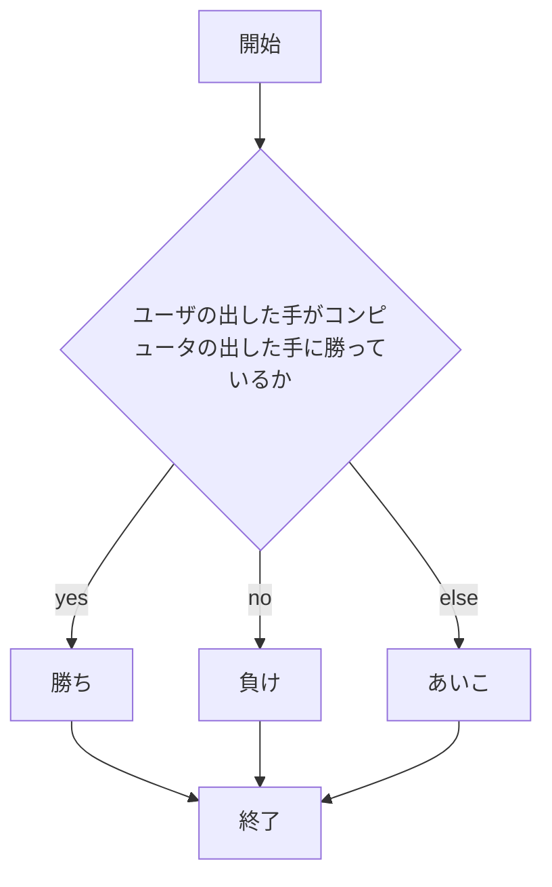
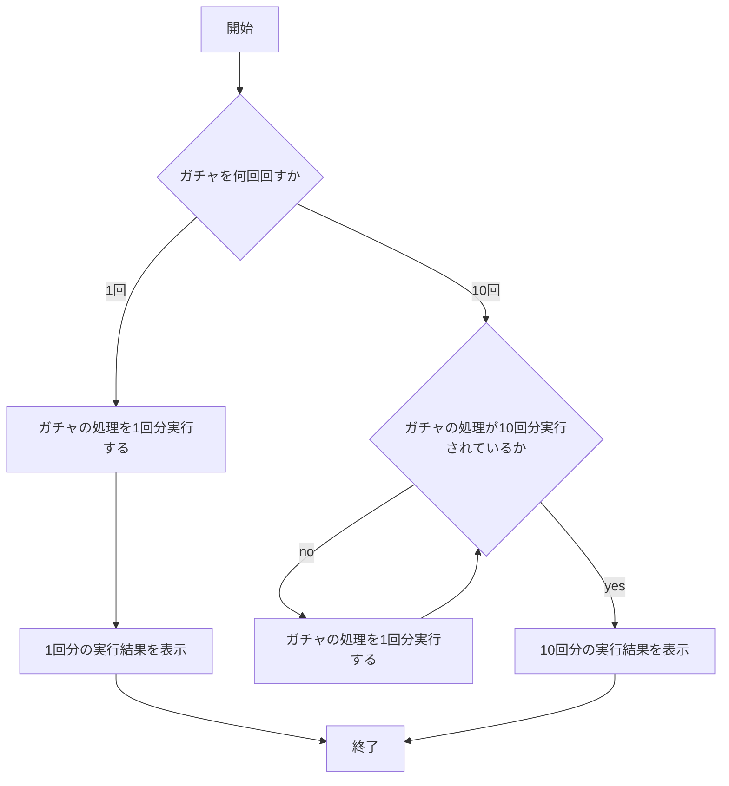
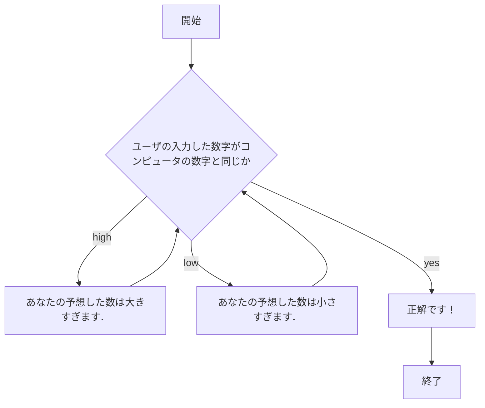

# app5.js
2024/12/25
## app5.jsの概要
app5.jsは，webpro_06ディレクトリの中に存在するファイルである．ファイル内には，以下の３つの機能が実装されている．
1. じゃんけん
1. 単発(1連)ガチャ及び10連ガチャ
1. 1から100までの数字を予想する数当てゲーム
## ファイル一覧
実装されている機能を実行するためのプログラムを以下に示す．
ファイル名 | 説明
-|-
app5.js | 機能を実行するためのプログラム本体
public/janken.html | じゃんけんの機能を実行した時に最初に表示される画面を記述するファイル
public/gatya.html | ガチャの機能を実行した時に最初に表示される画面を記述するファイル
public/math.html | 数当てゲームの機能を実行した時に最初に表示される画面を記述するファイル
views/janken.ejs | じゃんけんの機能を実行した時の実行結果が表示される画面を記述するファイル
views/gatya.ejs | ガチャの機能を実行した時の実行結果が表示される画面を記述するファイル
views/math.ejs | 数当てゲームの機能を実行した時の実行結果が表示される画面を記述するファイル

## プログラムの利用方法
まず，すべての機能を利用する時に共通して行う作業の内容を以下に示す．
#### 全機能共通
1. ターミナルを起動し，```git clone https://github.com/ubukata0914/webpro_06.git```と入力して，webpro_06ディレクトリをクローンする．
2. ```cd webpro_06```と入力して，webpro_06に移動する．
3. 最初の一回のみ```npm install```と入力して，必要なパッケージを入手する．
1. ```node app5.js```と入力して，プログラム本体を起動する．

次に，各機能を利用する時に個別に行う作業の内容を以下に示す．
#### じゃんけん
1. webブラウザを開き，localhost:8080/public/janken.htmlにアクセスする．
1. 入力欄にグー，チョキ，パーのいずれかをユーザが入力して，送信ボタンを押して送信する．
1. じゃんけんの勝敗，じゃんけんの合計実行回数とそのうち何回勝利したかが表示される．
#### ガチャ
1. webブラウザを開き，localhost:8080/public/gatya.htmlにアクセスする．
1. 入力欄に1か10のどちらかの数字をユーザが入力して，送信ボタンを押して送信する．
1. 1を入力した場合は単発ガチャ，10を入力した場合は10連ガチャを回した結果とガチャの合計実行回数が表示される．
1. ガチャは，SSRが5%，SRが15%，Rが80%の確率で排出され，10連ガチャを実行した場合は最後のSSRとSRのどちらかが必ず排出される．
#### 数当てゲーム
1. webブラウザを開き，localhost:8080/public/math.htmlにアクセスする．
1. 入力欄に1から100までのいずれかの数字をユーザが入力して，送信ボタンを押して送信する．
1. 入力した数字が，正解の数字と比べて大きい場合は「あなたの予想した数は大きすぎます．」と表示される．小さい場合は「あなたの予想した数は小さすぎます．」と表示される．一致する場合は「正解です！」と表示される．また，入力した数字と正解するまでの合計実行回数も同時に表示される．
1. 表示されたメッセージを基に正解の数字の推測，特定を行う．

## フローチャート
#### じゃんけん


#### ガチャ


#### 数当てゲーム



