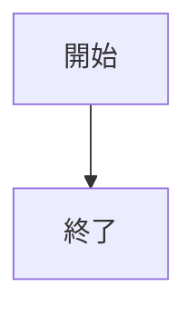
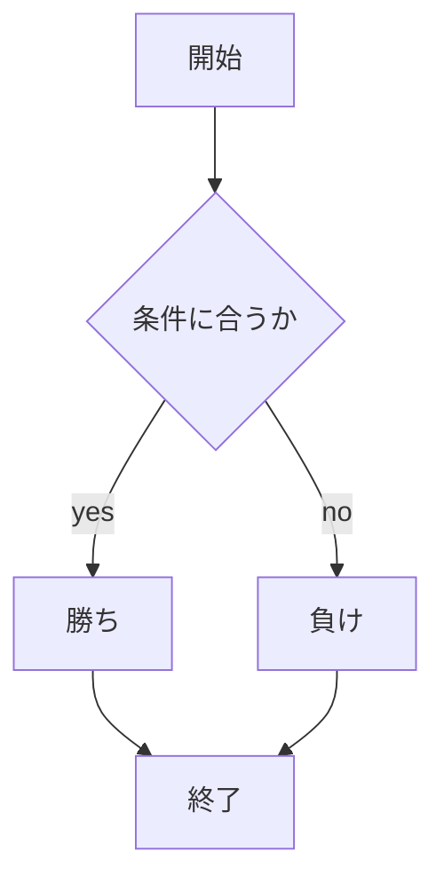

# webpro_06
2024/10/29
## このプログラムについて
じゃんけんができるプログラム
### ファイル一覧
ファイル名 | 説明
-|-
app5.js | プログラム本体
public/janken.html | じゃんけんの開始画面
views/janken.ejs | じゃんけんのテンプレートファイル

```javascript
console.log('Hello');
```

1. ```node app5.js```でプログラムを起動
1. webブラウザでlocalhost:8080/public/janken.htmlにアクセス
1. 自分の手で入力






