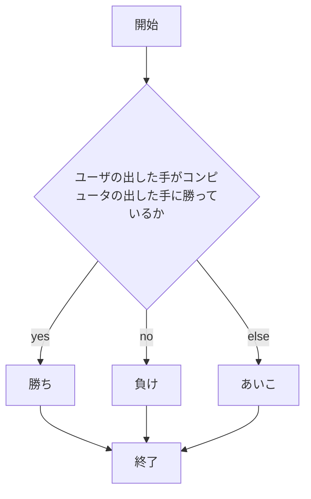
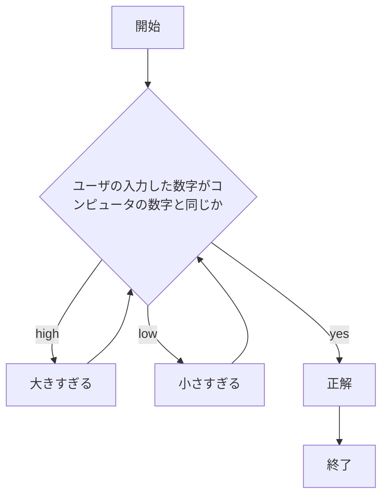

# app5.js
2024/12/25
## app5.jsの概要
app5.jsは，webpro_06ディレクトリの中に存在するファイルである．ファイル内には，以下の３つの機能が実装されている．
1. じゃんけん
1. 単発(1連)ガチャ及び10連ガチャ
1. 1から100までの数字を予想する数当てゲーム
## ファイル一覧
実装されている機能を実行するためのプログラムを以下に示す．
ファイル名 | 説明
-|-
app5.js | 機能を実行するためのプログラム本体
public/janken.html | じゃんけんの機能を実行した時に最初に表示される画面を記述するファイル
public/gatya.html | ガチャの機能を実行した時に最初に表示される画面を記述するファイル
public/math.html | 数当てゲームの機能を実行した時に最初に表示される画面を記述するファイル
views/janken.ejs | じゃんけんの機能を実行した時の実行結果が表示される画面を記述するファイル
views/gatya.ejs | ガチャの機能を実行した時の実行結果が表示される画面を記述するファイル
views/math.ejs | 数当てゲームの機能を実行した時の実行結果が表示される画面を記述するファイル

## プログラムの利用方法
まず，
#### じゃんけん
1. ターミナルを起動し，```cd webpro_06```と入力してwebpro_06に移動する
1. 最初の一回のみ，```npm install```と入力して必要なパッケージを入手する
1. ```node app5.js```と入力してプログラムを起動する
1. webブラウザを開き，localhost:8080/public/janken.htmlにアクセス
1. 入力欄にグー，チョキ，パーのいずれかをユーザが入力して，送信ボタンで送信する
1. 勝敗の結果が表示される
#### ガチャ
1. ターミナルを起動しwebpro_06に移動する
1. 最初の一回のみ，```npm install```で必要なパッケージを入手する
1. ```node app5.js```でプログラムを起動
1. webブラウザでlocalhost:8080/public/gatya.htmlにアクセス
1. 1か10のどちらかの数字をユーザが入力して送信する
1. 1を入力した場合は単発ガチャ，10を入力した場合は10連ガチャを回した結果が表示される
#### 数当てゲーム
1. ターミナルを起動しwebpro_06に移動する
1. 最初の一回のみ，```npm install```で必要なパッケージを入手する
1. ```node app5.js```でプログラムを起動
1. webブラウザでlocalhost:8080/public/math.htmlにアクセス
1. 1から100までのいずれかの数字をユーザが入力して送信する
1. 入力した数字が答えの数字と比べて大きいか小さいかが表示される
1. 表示を基に答えの数字を推測し，答えの数字の特定を目指す

## フローチャート
#### じゃんけん


#### ガチャ


#### 数当てゲーム



