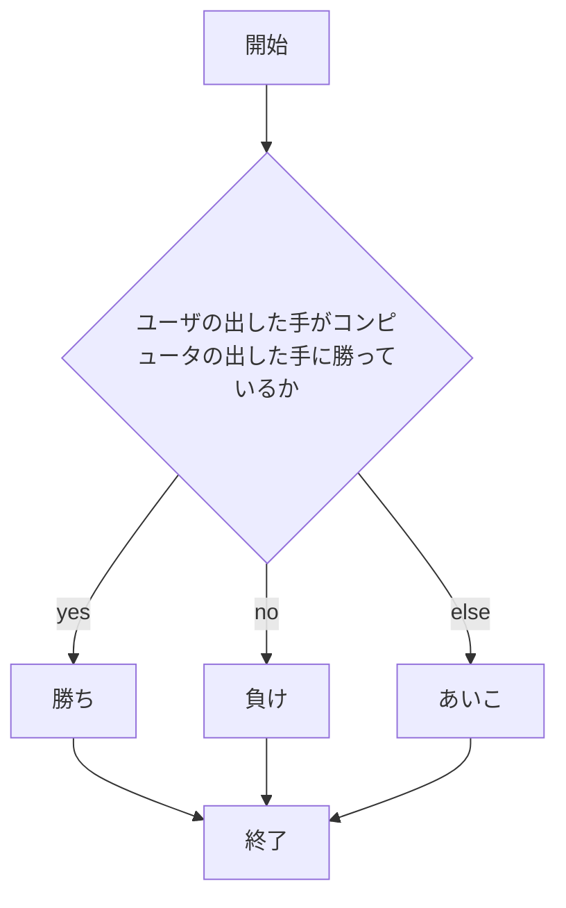
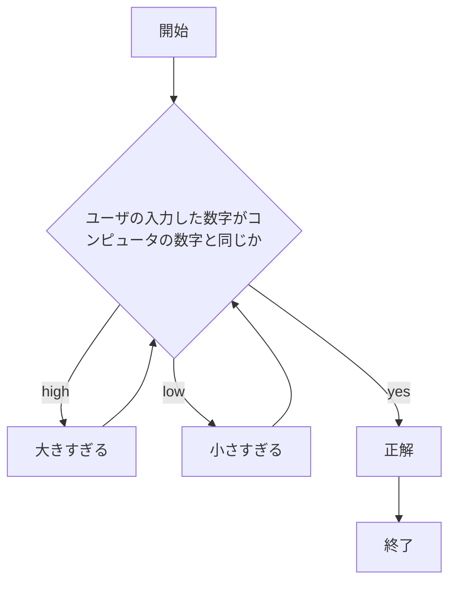

# webpro_06
2024/11/18
## このプログラムについて
以下の３つの機能が実装されている
1. じゃんけんができるプログラム
1. 単発(1連ガチャ)または10連ガチャができるプログラム
1. 1から100までの数字を予想する数当てゲームができるプログラム
## ファイル一覧
ファイル名 | 説明
-|-
app5.js | プログラム本体
public/janken.html | じゃんけんの開始画面
public/gatya.html | ガチャの開始画面
public/math.html | 数当てゲームの開始画面
views/janken.ejs | じゃんけんのテンプレートファイル
views/gatya.ejs | ガチャのテンプレートファイル
views/math.ejs | 数当てゲームのテンプレートファイル

## プログラムの利用方法
#### じゃんけん
1. ターミナルを起動しwebpro_06に移動する
1. 最初の一回のみ，```npm install```で必要なパッケージを入手する
1. ```node app5.js```でプログラムを起動
1. webブラウザでlocalhost:8080/public/janken.htmlにアクセス
1. グー，チョキ，パーのいずれかの手をユーザが入力して送信する
1. 勝敗の結果が表示される
#### ガチャ
1. ターミナルを起動しwebpro_06に移動する
1. 最初の一回のみ，```npm install```で必要なパッケージを入手する
1. ```node app5.js```でプログラムを起動
1. webブラウザでlocalhost:8080/public/gatya.htmlにアクセス
1. 1か10のどちらかの数字をユーザが入力して送信する
1. 1を入力した場合は単発ガチャ，10を入力した場合は10連ガチャを回した結果が表示される
#### 数当てゲーム
1. ターミナルを起動しwebpro_06に移動する
1. 最初の一回のみ，```npm install```で必要なパッケージを入手する
1. ```node app5.js```でプログラムを起動
1. webブラウザでlocalhost:8080/public/math.htmlにアクセス
1. 1から100までのいずれかの数字をユーザが入力して送信する
1. 入力した数字が答えの数字と比べて大きいか小さいかが表示される
1. 表示を基に答えの数字を推測し，答えの数字の特定を目指す

## フローチャート
#### じゃんけん


#### ガチャ


#### 数当てゲーム



